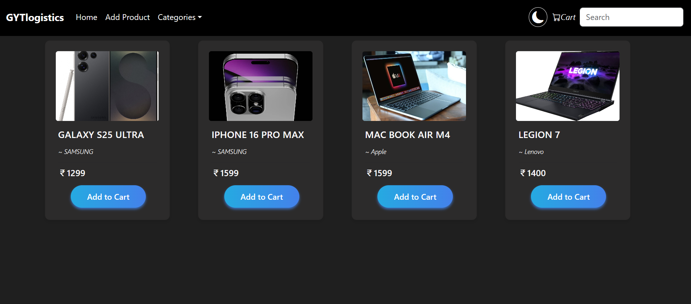

# DropShipper-Ecomerce-Site
This is project on Ecomerce site where DropShippers can easily add their product Details and keep products to Sell

---
## Screenshots
- 
- Product Page(Screenshot 2025-06-20 123333.png)
- Cart(Screenshot 2025-06-20 123438.png)
- (Screenshot 2025-06-20 123353.png)
- (Screenshot 2025-06-20 123410.png)
---

## 🚀 Technologies Used

### 🧩 Backend (Spring Boot)
- Java 17+
- Spring Boot
- Spring Web
- Spring Data JPA
- H2
- Maven

### 🎨 Frontend (React.js)
- React 18+
- Axios (for API calls)
- React Router
- Bootstrap / Tailwind CSS (customizable)

---

## ⚙️ Getting Started

### 📦 Prerequisites
- Node.js & npm
- Java JDK (17+)
- Maven
- Git

---

### 🛠 Backend Setup (Spring Boot)

```bash
# Navigate to project root
cd Ecom-Proj

# Run using Maven
./mvnw spring-boot:run
